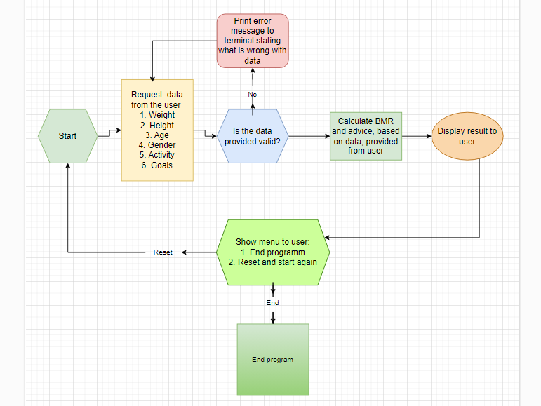
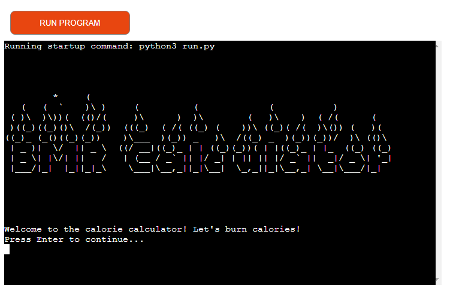
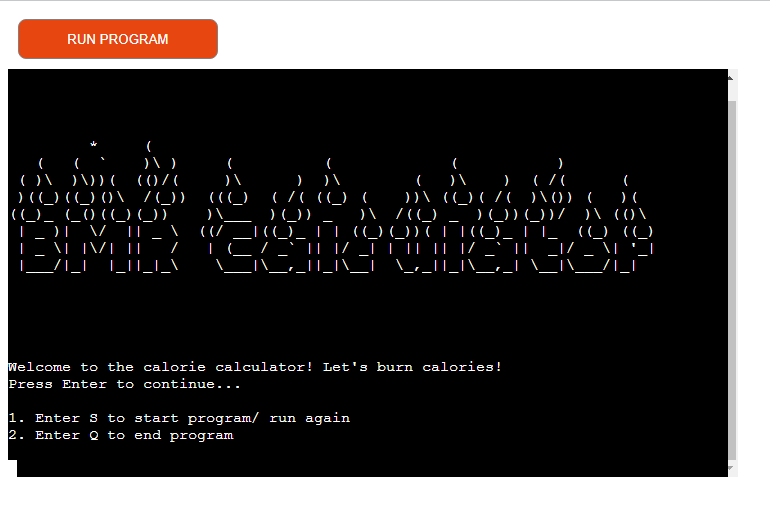
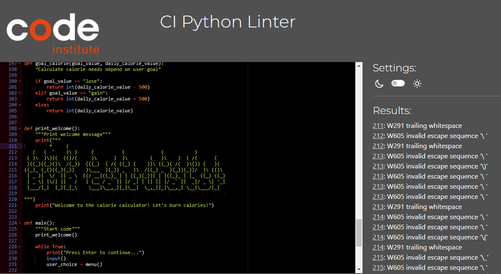

# **Calorie Calculator**
## **Overview**

Calorie Calculator is a console application for calculating daily calorie requirements based on height, weight, gender, and physical activity. In this application, the user inputs the required data, and based on that, the program calculates the basal metabolic rate (BMR). This is the minimum number of calories required by our body to perform basic functions such as breathing, blood circulation, and cell production while at rest. In other words, it is the amount of energy our body needs to continue functioning while doing nothing.

Additionally, the user can receive recommendations on how many calories they should consume per day to achieve their goal, whether it is to lose, gain, or maintain weight.

To calculate the basal metabolic rate, the Harris-Benedict formula is used, based on total body mass, height, age, and gender. The application uses recommendations from The Centers for Disease Control and Prevention for weight loss and weight gain to calculate daily calorie requirements.

The application is created in Python and uses functions, loops, and conditional statements to calculate the result.

## Table of contents:
1. [**Overview**](#overview)
1. [**Planning stage**](#planning-stage)
    * [***Target Audiences***](#target-audiences)
    * [***User Stories***](#user-stories)
    * [***App Aims***](#app-aims)
    * [***App diagrams***](#app-diagrams)
1. [**Current Features**](#current-features)
    * [***Start Screen***](#start-screen)
    * [***Control the program***](#control-the-program)
1. [**Future-Enhancements**](#future-enhancements)
1. [**Testing Phase**](#testing-phase)
1. [**Deployment**](#deployment)
1. [**Tech**](#tech)
1. [**Credits**](#credits)
    * [**Content**](#content)
    * [**Media**](#media)
    * [**Honourable mentions**](#honorable-mentions)
​
## **Planning Stage**

#### **Target Audiences:**
* People who want to lose weight and are interested in monitoring their calorie intake to create a calorie deficit and achieve weight loss.
* People who want to maintain their weight and use a calorie calculator to determine their daily calorie needs to maintain their current weight.
* Physically active people and Athletes, who need to determine their daily calorie needs to support their training and physical activity.
* People with health conditions, such as diabetes, who want to monitor their calorie intake and manage their condition.
* Fitness and health and professionals, such as dietitians and personal trainers, who create custom nutrition plans for their clients.

 

#### **User Stories:**
* As a user, I want to understand how to start the program.
* As a user, I want to quickly learn and understand how to control the application
* As a user, I want a clean and simple user interface.
* As a user, I want the app to run smoothly and bug-free and how to fix them if they are happening (if I enter not valid data )
* As a user, I want to get calculated results after entering the data
* As a user, I want to be able to choose whether or not to run app again when it ends.

 

#### **App Aims:**
* To offer the user a smooth and bug free version of a classic game with a slightly different twist.
* To provide a clean and simple interface for the user with no need to reference external sources.
* To provide clear instructions and a win condition.
* To provide an enjoyable user experience of playing battleships.
* To provide an interesting and entertaining Star Wars-based version of the game.

 

#### **App diagrams**

I used [app.diagrams.net](app.diagrams.net) to planning stages of this project

This is the flow chart of the app:

 

## **Current Features**

#### **Start Screen** 

* The start screen features the name of the program - BMR Calculator. Then app prompts to press enter and chose to end the program or start.

#### **Control the program**

* To control the program user can use the menu at the start and at the end of the program.  User enter data with keyboard follow the instruction on the screen. 

## **Future-Enhancements**
​
There are several features with scope for future improvement. I would have liked to add the following in future:
​
* Recomendation how to speed up the metabolic rate, for example, by increasing or changing physical activity, improving diet and sleep, calorie content and food composition.
* Add calculate the rate of proteins, fats, carbohydrates

## **Testing Phase**
​
**Functionality**

* I made sure the app performed as expected from start to finish.
* I tried to use the app on a local terminal and on Heroku several times. The app worked as anticipated with no errors.
* When entering incorrect data, I saw error messages on the screen and suggestions on how to fix them in order to continue the application

**Validators**

* The validator shows a number of minor warnings, which are related to the use of the ASCII art used in the start screen. In my final mentor session, I was informed these are inconsequential and can essentially be ignored as they do not affect the program itself.

## **Bugs**
​
The following bugs were identified during user testing:
* The daily calorie intake was calculated incorrectly, the result was the same with basal metabolism.

✅ Solution: in the calorie_calculator function, I changed the compared data from a string to an integer, because the get_user_activity function, which asks the user for the activity level, returns an integer

* In several functions that accept user input, the data validator signalled an error when a word was capitalized.

✅ Solution: added the lower() method to these functions to convert all input data to a single form

## **Deployment**

## ***Final Deployment to Heroku:***  
  
The project was deployed to [Heroku](https://www.heroku.com) using the below procedure:-    
  
1. **Log in to Heroku** or create an account if required.
1. **click** the button labeled **New** from the dashboard in the top right corner, just below the header.
1. From the drop-down menu **select "Create new app"**.
1. **Enter a unique app name**. I chose Health-calculators for this project.
1. Once the web portal shows the green tick to confirm the name is original **select the relevant region.** In my case, I chose Europe as I am in the Ireland.
1.  When happy with your choice of name and that the correct region is selected, **click** on the **"Create app" button**.
1. This will bring you to the project "Deploy" tab. From here, navigate to the **settings tab** and scroll down to the **"Config Vars" section**. 
1. **Click** the button labelled **"Reveal Config Vars"** and **enter** the **"key" as port**, the **"value" as 8000** and **click** the **"add"** button.
1. Scroll down to the **buildpacks section of the settings page** and click the button labeled **" add buildpack," select "Python," and click "Save Changes"**.
1. **Repeat step 11 but** this time **add "node.js" instead of python**. 
   * ***IMPORTANT*** The buildpacks must be in the correct order. If node.js is listed first under this section, you can click on python and drag it upwards to change it to the first buildpack in the list.
1. Scroll back to the top of the settings page, and **navigate to the "Deploy" tab.**
1. From the deploy tab **select Github as the deployment method**.
1. **Confirm** you want to **connect to GitHub**.
1. **Search** for the **repository name** and **click** the **connect** button next to the intended repository.
1. From the bottom of the deploy page **select your preferred deployment type** by follow one of the below steps:  
   * Clicking either "Enable Automatic Deploys" for automatic deployment when you push updates to Github.  
   * Select the correct branch for deployment from the drop-down menu and click the "Deploy Branch" button for manual deployment. 

The final deployment can be viewed [here](https://health-calculators.herokuapp.com/)
